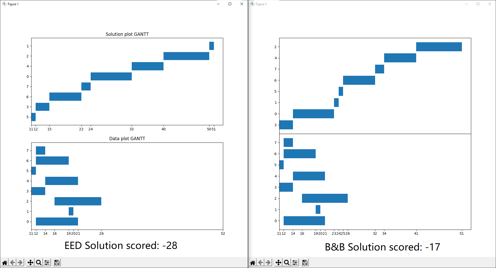
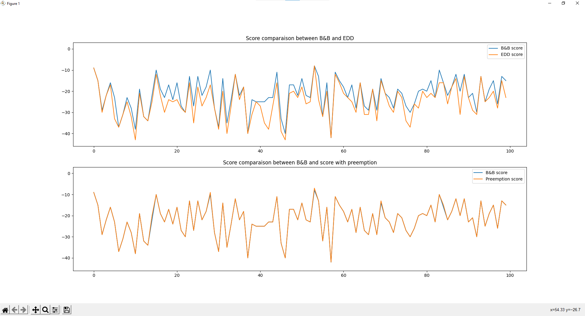

# Single Machine Scheduling Problem

## Problem brief description
This problem consists of a list of jobs and one single machine that needs to execute all of these jobs once at a time. A job is described as a tuple of 4 integers (release_date, process_duration, due_date, job_id).
- Release_date: The instant when the job is available for execution.
- Process_duration: The time needed for the job to finish exectuion.
- Due_date: The job deadline.
- Joe_id: A unique identifier for each job.

The problem is that we need to execute these jobs with minimal lateness. Meaning, optimally each job should finish before its corressponding deadline.
This problem is considered as a NP-Hard problem because the number of acceptable solutions is n! (n factorial).

This repo provides a B&B solution to this problem. The B&B method will find the optimal solution with the help of a heuristic function.

The performance of each solution will be measured with Lmax sore. Lmax ∈ [-∞, 0]. 0 means all jobs have met their deadline and -n meaning there is at least a job that didn't meet the deadline by n units.

**Assumptions :**
- All jobs are generated with the poisson process before the execution of the algorithm, to mimic the behaviour of clients or rush hours where there is a spike in jobs count for example.

## First approach: Earliest Due Date (EDD)
Sort jobs with respect to due date and release date of each job. Acceptable solution but not optimal.
This approach will be used as the starting solution of the Branch and Bound method.

## Second approach: Branch and Bound (B&B)
This approach uses a heuritic function that determines whether or not to branch or to bound a node (a group of solutions).
The heuristic function will exploit the constraint of each job must be executed without interruption. It will ignore this constraint and hence produce a non acceptable solution but will result in a much better (close to 0) Lmax score.

Upon running singlemachine.py file you will be greeted with a list of choices either to run a simution n times or just a single run to visualize gantt diagrams.

**A single run**

**Simulation**
As you can see here, the B&B score is worse or equal to the heuristic score and better or equal than the EDD score, which is expected.

